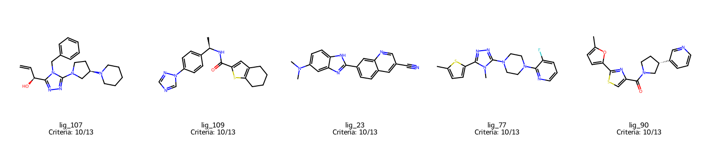
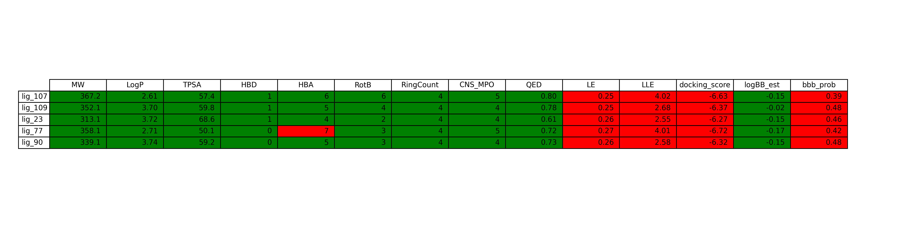

# 🧬 DYRK1A Virtual Screening Pipeline

**Решение команды "Квадрицепс" хакатона DataCon 2025**  
*Виртуальный скрининг ингибиторов киназы DYRK1A для терапии болезни Альцгеймера*

[](https://python.org)
[](LICENSE)
[](https://github.com/astral-sh/uv)

## 📋 Содержание

- [🎯 О проекте](#-о-проекте)
- [🔬 Методология](#-методология)
- [🏗️ Архитектура](#️-архитектура)
- [⚙️ Установка](#️-установка)
- [🚀 Быстрый старт](#-быстрый-старт)
- [📊 Результаты](#-результаты)
- [🔧 Использование](#-использование)
- [📁 Структура проекта](#-структура-проекта)

## 🎯 О проекте

Данный проект представляет собой комплексный pipeline для виртуального скрининга потенциальных ингибиторов киназы **DYRK1A** - перспективной мишени для терапии болезни Альцгеймера. 

### 🎯 Выбор мишени

После детального анализа шести потенциальных мишеней (Aβ, Tau, TREM2, GSK-3β, DYRK1A, Fyn) была выбрана **киназа DYRK1A** как оптимальная мишень по следующим критериям:

- ✅ **Научная актуальность**: DYRK1A участвует в патогенезе БА через фосфорилирование тау-белка и образование Aβ
- ✅ **Данные по лигандам**: Известны десятки ингибиторов с IC₅₀ в нМ диапазоне
- ✅ **Структурная информация**: Решены кристаллографические структуры с лигандами
- ✅ **Пригодность для in silico дизайна**: Классический ATP-связывающий карман
- ✅ **Лекарственная перспективность**: Селективные ингибиторы уже показали эффективность в доклинических тестах

### 🎯 Цели проекта

1. **Сбор и анализ данных** по активности соединений против DYRK1A
2. **Разработка QSAR моделей** для предсказания активности
3. **Генерация новых молекул** с использованием современных ML подходов
4. **Виртуальный скрининг** с молекулярным докингом
5. **Отбор перспективных кандидатов** с оценкой дезирабельности

## 🔬 Методология

### 📊 Step 1: Анализ мишеней
- Сравнительный анализ 6 потенциальных мишеней БА
- Оценка по 5 критериям: патогенетическая значимость, данные по лигандам, структурная информация, пригодность для in silico дизайна, лекарственная перспективность
- Выбор DYRK1A как оптимальной мишени
- 📖 **Подробное исследование**: [research.md](research.md) - детальный анализ выбора мишени с научным обоснованием

### 🧪 Step 2: Сбор данных и QSAR моделирование
- **Сбор данных**: Извлечение данных по активности соединений из ChEMBL
- **Расчет дескрипторов**: Мордред, PaDEL, RDKit дескрипторы
- **Feature selection**: Отбор наиболее информативных признаков
- **Моделирование**: 
  - Scaffold split для химически корректной валидации
  - XGBoost с GPU ускорением
  - Optuna для гиперпараметрической оптимизации

### 🧬 Step 3: Генерация молекул
- **VAE модели**: SELFIES и Transformer VAE
- **Fine-tuning**: DPO и RLHF для улучшения качества
- **Docking-guided generation**: Генерация с учетом докинга
- **Валидация**: Проверка химической корректности и уникальности

**🔬 Экспериментальные подходы:**
В процессе разработки были опробованы различные методы генерации молекул:
- **VAE модели**: SELFIES VAE, Transformer VAE - показали низкую валидность сгенерированных структур
- **Fine-tuning**: DPO (Direct Preference Optimization) и RLHF (Reinforcement Learning from Human Feedback) - сложность в настройке и нестабильность обучения
- **Docking-guided generation**: Попытки генерации с учетом docking scores - технические сложности интеграции

**✅ Финальный подход:**
Остановились на **fine-tuning предобученной модели** (entropy/gpt2_zinc_87m) на 3 эпохи, так как:
- Loss стабильно падал с 2.71 → 0.66 → 0.32
- Дальнейшее обучение могло привести к переобучению
- Достигнута валидность 981 молекулы из 1000 сгенерированных

### 🎯 Step 4: Виртуальный скрининг
- **Подготовка белка**: Очистка и подготовка структуры DYRK1A
- **Подготовка лигандов**: Конвертация в PDBQT формат
- **GPU-ускоренный докинг**: AutoDock Vina с CUDA
- **Ранжирование**: Композитный скор с учетом активности, липидофильности, токсичности

## 🏗️ Архитектура

```
datacon2025hack/
├── step_01_target_selection/     # Анализ и выбор мишени
├── step_02_activity_prediction/  # QSAR моделирование
├── step_03_molecule_generation/  # Генерация молекул
├── step_04_hit_selection/       # Виртуальный скрининг
├── data/                        # Данные и результаты
├── utils/                       # Утилиты
└── config.py                    # Конфигурация
```

### 🛠️ Технологический стек

- **Data Processing**: `polars`, `polars-ds`, `numpy`
- **Chemistry**: `rdkit`, `mordred`, `padelpy`
- **Machine Learning**: `scikit-learn`, `xgboost`, `lightgbm`
- **Deep Learning**: `torch`, `torch-geometric`, `transformers`
- **Molecular Docking**: `AutoDock Vina`, `OpenBabel`
- **Visualization**: `plotly`, `matplotlib`, `seaborn`
- **Optimization**: `optuna`
- **Development**: `uv`, `ruff`, `loguru`

## ⚙️ Установка

### Предварительные требования

1. **Python 3.13+**
2. **uv** (менеджер пакетов):
   ```bash
   # macOS
   brew install astral-sh/astral/uv
   
   # Linux
   curl -Ls https://astral.sh/uv/install.sh | bash
   
   # Arch Linux
   paru -S openbabel autodock-vina
   ```

3. **OpenBabel и AutoDock Vina**:
   ```bash
   # Ubuntu/Debian
   sudo apt-get install openbabel autodock-vina
   
   # macOS
   brew install open-babel autodock-vina
   
   # Arch Linux
   sudo pacman -S openbabel autodock-vina
   ```

### Установка проекта

```bash
# Клонирование репозитория
git clone https://github.com/gulldan/datacon2025hack.git
cd datacon2025hack

# Установка зависимостей
uv sync

# Активация виртуального окружения
source .venv/bin/activate
```

## 🚀 Быстрый старт

### Запуск полного pipeline

```bash
# Один клик - запуск всего pipeline
./run.sh
```

### Пошаговое выполнение

```bash
# Step 1: Анализ мишеней
uv run python step_01_target_selection/run_target_analysis.py

# Step 2: QSAR моделирование
uv run python step_02_activity_prediction/data_collection.py
uv run python step_02_activity_prediction/run_descriptor_calc.py
uv run python step_02_activity_prediction/train_activity_model_scaffold.py

# Step 3: Генерация молекул
uv run python step_03_molecule_generation/run_generation.py
uv run python step_03_molecule_generation/validate_generated.py

# Step 4: Виртуальный скрининг
uv run python step_04_hit_selection/run_vina.py
uv run python analize_results.py
uv run python desirability_ranking.py
uv run python draw_molecules.py
```

## 📊 Результаты


### 📈 Ключевые метрики

- **QSAR модель**: R² = 0.628, RMSE = 0.718 (scaffold split)
- **Генерация**: 981 валидных молекул из 1000 сгенерированных (98.1% валидность)
- **Докинг**: 809 соединений успешно проанализировано (5 молекул не удалось подготовить)
- **Время выполнения**: ~1 часа на CPU
- **Fine-tuning**: 3 эпохи, loss: 2.71 → 0.66 → 0.32

### 🎯 Drug Discovery Filters Analysis

**Lipinski Rule of 5** (814 молекул):
- ✅ **MW ≤ 500**: 789/814 (96.9%)
- ✅ **LogP ≤ 5**: 739/814 (90.8%)
- ✅ **HBD ≤ 5**: 814/814 (100.0%)
- ✅ **HBA ≤ 10**: 814/814 (100.0%)
- ✅ **TPSA ≤ 140**: 811/814 (99.6%)
- 🎯 **Все правила Lipinski**: 727/814 (89.3%)

**CNS Drug Filters** (для терапии БА):
- ✅ **MW ≤ 450**: 729/814 (89.6%)
- ⚠️ **LogP ≤ 3**: 387/814 (47.5%)
- ⚠️ **TPSA ≤ 90**: 580/814 (71.3%)
- ⚠️ **RotB ≤ 3**: 287/814 (35.3%)
- ⚠️ **CNS_MPO ≥ 4**: 200/814 (24.6%)
- 🎯 **Все CNS фильтры**: 63/814 (7.7%)

**Docking Performance**:
- 🎯 **Средний docking score**: -6.63 kcal/mol
- 🎯 **Лучший docking score**: -10.72 kcal/mol
- 🎯 **Соединения с score ≤ -7**: 226/814 (27.8%)

### 📊 Визуализация распределений параметров

#### 🔬 Core Physicochemical Properties


#### 🧠 BBB & CNS Penetration


#### 🏗️ Structure & Drug-likeness


#### ⚡ Binding Efficiency


#### 🧪 ADME & Toxicity


#### 🎯 CNS-Specific Parameters


#### 🚨 CNS Risk Assessment Heatmap


### 🧠 Строгие критерии для терапии болезни Альцгеймера

**Физико-химические / CNS-drug-likeness**:
- ✅ **MW ≤ 450 Da**: 729/814 (89.6%)
- ✅ **LogP 1-4**: 538/814 (66.1%)
- ⚠️ **TPSA < 70 Ų**: 295/814 (36.2%)
- ✅ **HBD ≤ 3**: 795/814 (97.7%)
- ✅ **HBA ≤ 7**: 786/814 (96.6%)
- ✅ **RotB ≤ 8**: 809/814 (99.4%)
- ⚠️ **QED 0.4-0.8**: 478/814 (58.7%)
- ⚠️ **CNS_MPO ≥ 4**: 200/814 (24.6%)

**Барьер кровь-мозг / проницаемость**:
- ⚠️ **logBB > -0.3**: 427/814 (52.5%)
- ❌ **P-gp efflux < 2**: 46/814 (5.7%)

**Целевая аффинность**:
- ❌ **Docking score < -8 kcal/mol**: 38/814 (4.7%)

**ADMET-безопасность**:
- ❌ **hERG IC₅₀ > 10 µM (hERG < 0.3)**: 32/814 (3.9%)

**Синтетическая реализуемость**:
- ✅ **SA-score < 5**: 814/814 (100.0%)

**🎯 Результат**: **0/814 (0.0%)** молекул проходят все строгие критерии для терапии БА

### 🖼️ Визуализация результатов

Проект генерирует детальные визуализации:
- Молекулярные структуры топ-кандидатов
- Параметрические таблицы с цветовой кодировкой
- Распределения дескрипторов
- Анализ docking poses

**🎯 Молекулы, максимально близкие к прохождению всех критериев**

| Молекула | Пройдено критериев | Не пройденные критерии (значение, порог) |
|----------|--------------------|------------------------------------------|
| lig_23   | 10/13              | P-gp efflux: 3.11 (>2), Docking: -6.27 (> -8), hERG: 0.49 (<0.3) |
| lig_77   | 10/13              | P-gp efflux: 2.80 (>2), Docking: -6.72 (> -8), hERG: 0.48 (<0.3) |
| lig_90   | 10/13              | P-gp efflux: 3.17 (>2), Docking: -6.32 (> -8), hERG: 0.51 (<0.3) |
| lig_107  | 10/13              | P-gp efflux: 2.78 (>2), Docking: -6.63 (> -8), hERG: 0.45 (<0.3) |
| lig_109  | 10/13              | P-gp efflux: 3.18 (>2), Docking: -6.37 (> -8), hERG: 0.51 (<0.3) |
| lig_134  | 9/13               | QED: 0.89 (0.4-0.8), P-gp efflux: 3.12 (>2), Docking: N/A (<-8), hERG: 0.43 (<0.3) |
| lig_156  | 9/13               | QED: 0.93 (0.4-0.8), P-gp efflux: 2.55 (>2), Docking: N/A (<-8), hERG: 0.37 (<0.3) |
| lig_351  | 9/13               | QED: 0.93 (0.4-0.8), logBB: -0.32 (> -0.3), P-gp efflux: 2.42 (>2), Docking: N/A (<-8), hERG: 0.35 (<0.3) |
| lig_519  | 9/13               | QED: 0.86 (0.4-0.8), CNS_MPO: 3.00 (≥4), P-gp efflux: 3.23 (>2), Docking: N/A (<-8), hERG: 0.44 (<0.3) |
| lig_540  | 7/13               | TPSA: 78.68 (<70), QED: 0.88 (0.4-0.8), CNS_MPO: 2.00 (≥4), logBB: -0.62 (> -0.3), P-gp efflux: 2.37 (>2), Docking: N/A (<-8), hERG: 0.36 (<0.3) |

> **Примечание:**
> - P-gp efflux: должно быть <2 (чем меньше, тем лучше проникновение в мозг)
> - Docking: должно быть < -8 (чем меньше, тем выше аффинность)
> - hERG: должно быть <0.3 (чем меньше, тем ниже риск кардиотоксичности)
> - QED: 0.4-0.8 (оптимальный диапазон лекарственной привлекательности)
> - CNS_MPO: ≥4 (оптимально для CNS)
> - TPSA: <70 (оптимально для проникновения через ГЭБ)
> - logBB: > -0.3 (лучше проникновение через ГЭБ)

**Вывод:**
Ни одна молекула не проходит все строгие критерии, но топ-5 молекул проходят 10 из 13 критериев. Основные барьеры — P-gp efflux, docking score и hERG.

### 🎯 Топ-5 перспективных кандидатов

Проект выявил 5 наиболее перспективных соединений с высокими показателями:

| Соединение | Composite Score | Docking Score | LE | LLE | CNS Score |
|------------|----------------|---------------|----|-----|-----------|
| **lig_674**  | 0.207          | -6.06 kcal/mol | 0.26 | 5.75 | 4 |
| **lig_155**  | 0.093          | -4.99 kcal/mol | 0.25 | 4.44 | 4 |
| **lig_232**  | 0.081          | -5.54 kcal/mol | 0.25 | 4.94 | 3 |
| **lig_794**  | 0.066          | -5.64 kcal/mol | 0.25 | 4.75 | 3 |
| **lig_601**  | 0.056          | -7.02 kcal/mol | 0.27 | 6.17 | 3 |

**📊 Composite Score** - наш композитный скор, учитывающий:
- Docking score (связывание с мишенью)
- ADMET свойства (токсичность, метаболизм)
- CNS-специфичные параметры (проникновение в мозг)
- Лигандную эффективность (LE, LLE)
- Химическую привлекательность (QED, SA score)

### 🖼️ Визуализация топ кандидатов

#### 🏆 Топ-5 молекул по Composite Score


#### 📋 Детальная таблица параметров топ-5 молекул


#### 🎯 Топ-5 молекул, максимально близких к прохождению всех критериев


#### 📊 Параметры молекул, близких к прохождению всех критериев


## 🔧 Использование

### Конфигурация

Основные параметры настраиваются в `config.py`


## 📁 Структура проекта

```
datacon2025hack/
├── 📊 step_01_target_selection/          # Анализ мишеней
│   ├── run_target_analysis.py
│   └── reports/
├── 🧪 step_02_activity_prediction/       # QSAR моделирование
│   ├── data_collection.py               # Сбор данных из ChEMBL
│   ├── descriptor_calculator.py         # Расчет дескрипторов
│   ├── feature_selection.py             # Отбор признаков
│   ├── train_activity_model_*.py        # Обучение моделей
│   └── results/                         # Результаты моделирования
├── 🧬 step_03_molecule_generation/      # Генерация молекул
│   ├── run_generation.py               # Основной скрипт генерации
│   ├── *_generator.py                  # Различные генераторы (VAE, Transformer)
│   ├── *_finetuner.py                  # Fine-tuning модели (DPO, RLHF)
│   ├── validate_generated.py           # Валидация молекул
│   └── results/                        # Сгенерированные молекулы
│   
│   📁 **Экспериментальные файлы** (не использовались в финальном pipeline):
│   ├── selfies_vae_generator.py        # SELFIES VAE генератор
│   ├── transformer_vae_generator.py    # Transformer VAE
│   ├── dpo_finetuner.py               # Direct Preference Optimization
│   ├── rlhf_finetuner.py              # RLHF fine-tuning
│   ├── docking_guided_generator.py     # Docking-guided generation
│   └── optuna_tune_vae.py             # Hyperparameter tuning для VAE
├── 🎯 step_04_hit_selection/           # Виртуальный скрининг
│   ├── protein_prep.py                 # Подготовка белка
│   ├── ligand_prep.py                  # Подготовка лигандов
│   ├── run_vina.py                     # Докинг
│   ├── accelerated_docking.py          # GPU-ускоренный докинг
│   ├── docking/                        # Файлы докинга
│   └── results/                        # Результаты скрининга
├── 📁 data/                            # Данные
│   ├── raw/                           # Исходные данные
│   ├── processed/                      # Обработанные данные
│   └── descriptors/                    # Молекулярные дескрипторы
├── 🛠️ utils/                           # Утилиты
│   ├── logger.py                      # Логирование
│   └── get_box_center.py              # Расчет центра бокса
├── 📋 config.py                        # Конфигурация
├── 🚀 run.sh                          # Скрипт запуска
├── 📊 analize_results.py              # Анализ результатов
├── 🎯 desirability_ranking.py         # Ранжирование по дезирабельности
├── 🖼️ draw_molecules.py               # Визуализация молекул
└── 📄 README.md                       # Документация
```

## 🏆 Команда "Квадрицепс"

**DataCon 2025** - Хакатон по drug discovery  
**Презентация**: [Google Slides](https://docs.google.com/presentation/d/1nh_DN6TUdSHA5uqRM2UpRV4C-0KNkTsYYusSdRcSSp8/edit?usp=sharing)

---

*Создано с ❤️ для продвижения drug discovery с использованием современных ML подходов*

